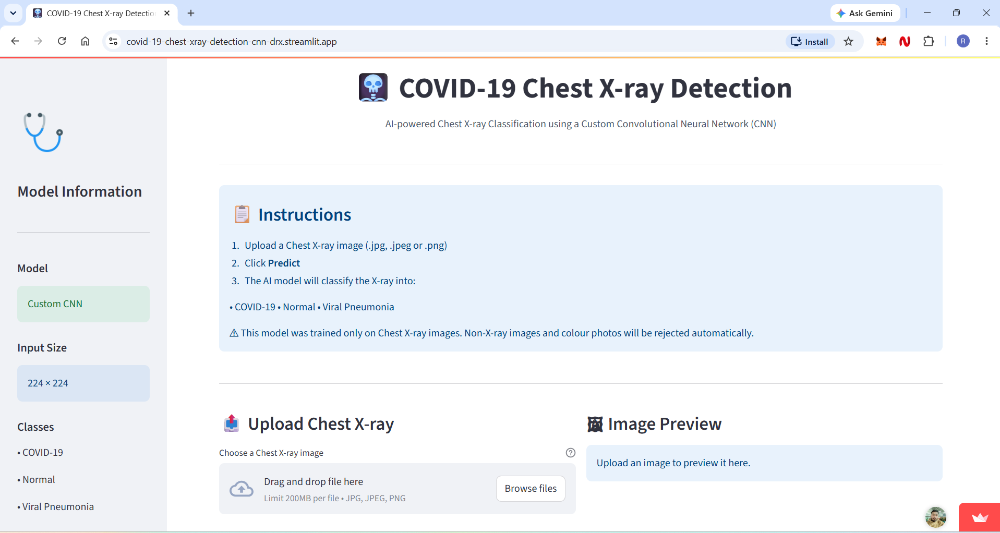
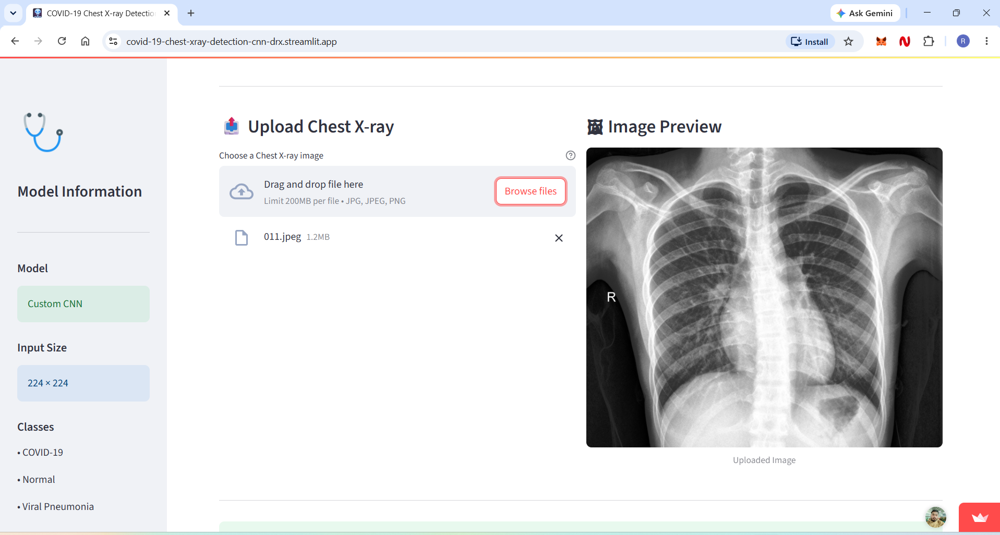
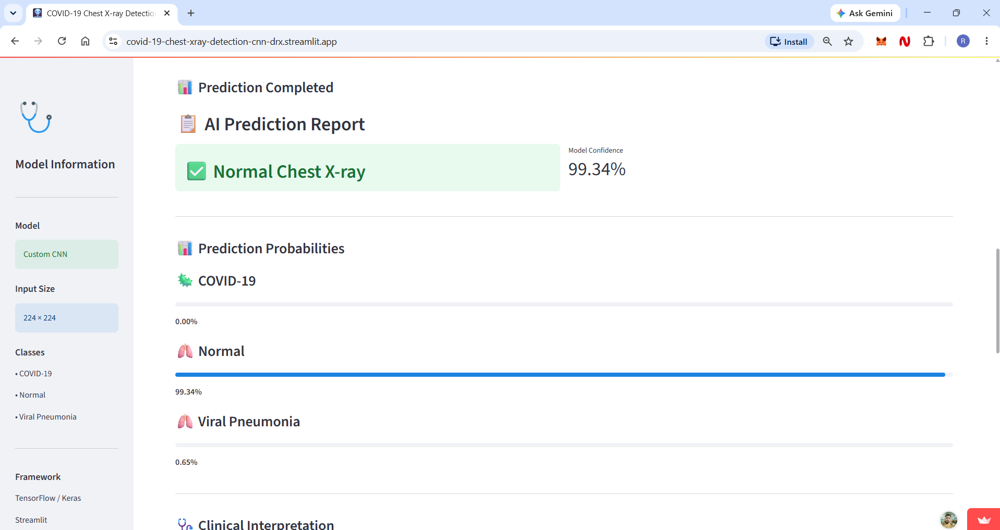
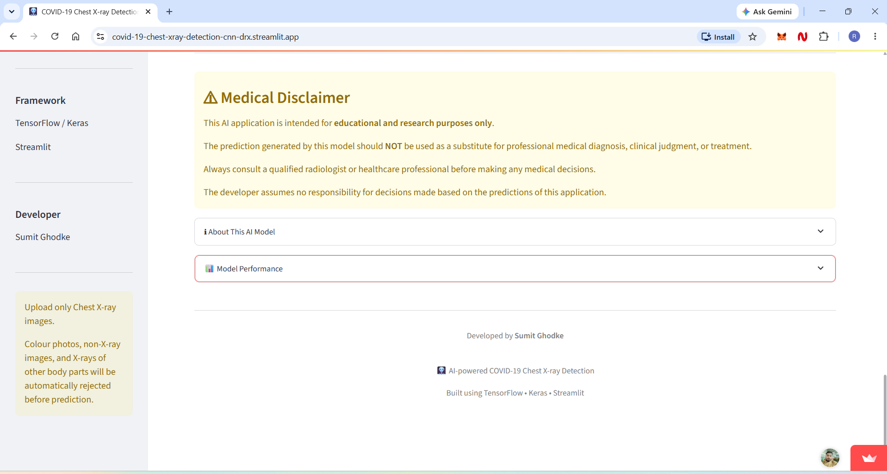

# 🩻 COVID-19 Chest X-ray Detection using Convolutional Neural Networks (CNN)

<p align="center">
  
</p>

<p align="center">


</p>

---

# 🌐 Live Demo

### 🚀 Web Application

https://covid-19-chest-xray-detection-cnn-drx.streamlit.app/

---

# 👨‍💻 Developer

**Sumit Ghodke**

🔗 LinkedIn

https://www.linkedin.com/in/sumit-ghodke-a45a82205/

---

# 📖 Project Overview

This project is a **Deep Learning based Medical Image Classification System** developed using **TensorFlow/Keras Convolutional Neural Networks (CNN)**.

The application analyzes **Chest X-ray images** and classifies them into one of the following categories:

- 🦠 COVID-19
- 🫁 Normal
- 🫁 Viral Pneumonia

The model is deployed as an interactive **Streamlit Web Application**, allowing users to upload a chest X-ray image and receive predictions with confidence scores in real time.

---

# 🎯 Problem Statement

COVID-19 spread rapidly across the world, placing tremendous pressure on healthcare systems.

Although RT-PCR remains the standard diagnostic method, it has limitations such as:

- Time-consuming testing process
- Limited testing availability
- Higher cost in some regions
- Delayed diagnosis

Chest X-ray imaging is widely available in hospitals and diagnostic centers.

This project demonstrates how **Artificial Intelligence and Convolutional Neural Networks (CNNs)** can assist healthcare professionals by providing rapid image classification for educational and research purposes.

---

# 💡 Solution

This AI-powered application provides:

✅ Automatic Chest X-ray Classification

✅ COVID-19 Detection

✅ Viral Pneumonia Detection

✅ Normal Chest X-ray Detection

✅ Prediction Confidence Score

✅ Interactive Web Interface

✅ Real-time Image Preview

✅ Medical Disclaimer

---

# 🧠 CNN Model

Model Type

- Custom Convolutional Neural Network (CNN)

Framework

- TensorFlow
- Keras

Input Size

- 224 × 224

Output Classes

- COVID-19
- Normal
- Viral Pneumonia

---

# ✨ Features

- Upload Chest X-ray Images
- Automatic Image Preprocessing
- CNN-based Prediction
- Prediction Confidence
- Class Probability Visualization
- Clean Streamlit UI
- Medical Disclaimer
- Educational & Research Purpose

---

# 📂 Project Structure

```text
COVID-19-Chest-XRay-Detection-CNN
│
├── covid19.ipynb                  # CNN Training Notebook
├── covid_classifier_final.keras   # Trained CNN Model
├── health.py                      # Streamlit Web Application
├── requirements.txt               # Python Dependencies
├── runtime.txt                    # Streamlit Python Version
├── .python-version                # Python Version
├── view1.png                      # Application Screenshot
├── view2.png
├── view3.png
├── view4.png
└── README.md
```

---

# 📸 Application Screenshots

## 🏠 Home Page


---

## 📤 Upload Chest X-ray



---

## 📊 Prediction Result



---

## 📄 Medical Disclaimer



---

# ⚙️ Installation

Clone Repository

```bash
git clone https://github.com/Sumitghodke16/COVID-19-Chest-XRay-Detection-CNN.git
```

Move into Project

```bash
cd COVID-19-Chest-XRay-Detection-CNN
```

Create Virtual Environment

```bash
python -m venv myenv
```

Activate Environment

Windows

```bash
myenv\Scripts\activate
```

Install Requirements

```bash
pip install -r requirements.txt
```

Run Streamlit

```bash
streamlit run health.py
```

---

# 📦 Technologies Used

- Python
- TensorFlow
- Keras
- NumPy
- Pandas
- OpenCV
- Pillow
- Matplotlib
- Streamlit

---

# 🖥️ Web Application

The application provides:

- Chest X-ray Upload
- Image Preview
- AI Prediction
- Confidence Score
- Prediction Probabilities
- Clinical Interpretation
- Medical Disclaimer

---

# ⚠️ Medical Disclaimer

This application is intended **only for educational and research purposes**.

It should **NOT** be used as a substitute for professional medical diagnosis, treatment, or clinical decision-making.

Always consult a qualified healthcare professional.

---

# 📈 Future Improvements

- Grad-CAM Heatmaps
- Explainable AI (XAI)
- Mobile Responsive Design
- DICOM Image Support
- Multi-language Support
- Docker Deployment
- Model Versioning
- Cloud API Integration

---

# ⭐ If you like this project

Please consider giving the repository a **Star ⭐**

It helps support future AI and Deep Learning projects.

---

# 📬 Contact

**Sumit Ghodke**

🔗 LinkedIn

https://www.linkedin.com/in/sumit-ghodke-a45a82205/

🌐 Live Application

https://covid-19-chest-xray-detection-cnn-drx.streamlit.app/
